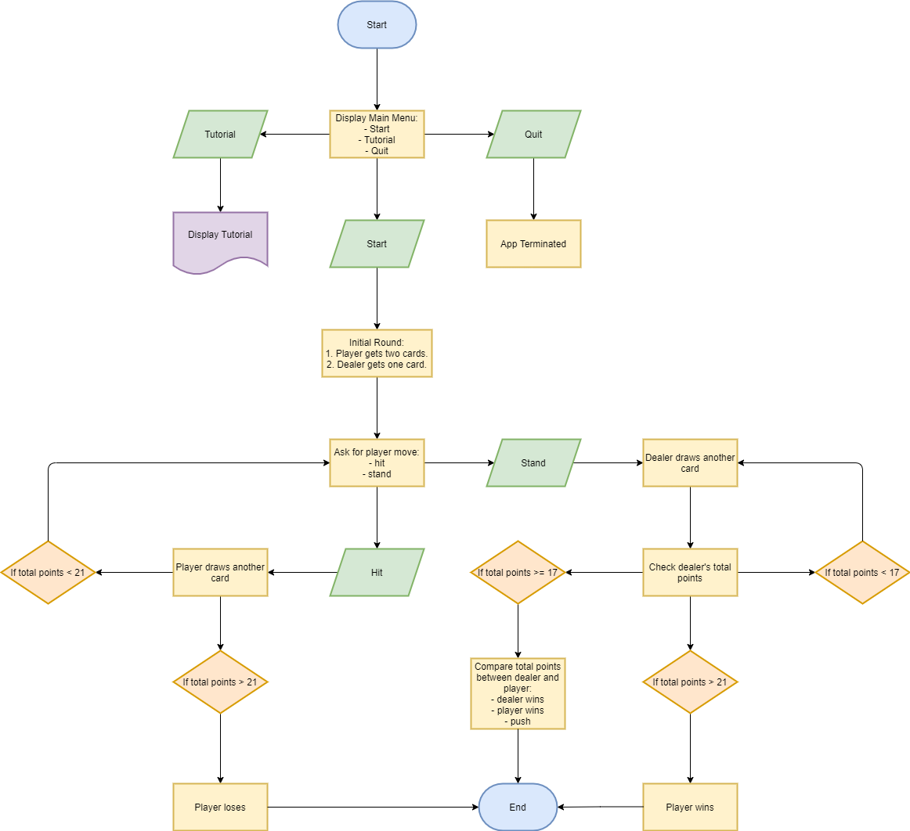

# T1A3 - Terminal Application - Shao Yee Ng

## R4 - Source Control Repository Link - GitHub

[GitHub](https://github.com/yee-codes/terminal_app-blackjack)

## R5 - Purpose and Scope

The application is based on the traditional casino card game Blackjack, also known as “21”. I have built this interactive application as part of the Coder Academy assignment to utilise knowledge and concepts that I’ve learnt in Term 1. 

The application has two main purposes for users. Firstly, it allows users to become familiar with Blackjack before playing a “live” game with friends or at the casino. Secondly, it also serves as a form of entertainment for users to play the game “on the go” or from the comfort of their own home as a single player without having to find a second person to be the dealer. 

The target audience of the application are my classmates and educators at Coder Academy.

To make the application extremely user friendly, the application includes screen prompts throughout each step of the game to assist the user. There is also a tutorial that users can refer to which outlines the rules and explains how the game works. 

For example, when a user first opens the application, the user will see that the cards are being shuffled and then dealt. The user gets dealt two cards and the application automatically adds the numbers on the cards together. The user will see that the dealer has one card and gets the option to “hit” or “stand” in order to get to “21” or a higher number than the dealer. 

If the user makes an option to “hit”, then the user will get drawn an additional card. If the user makes an option to “stand”, the user will get no further cards and the application will deal a card to the dealer. As per the rules of the traditional game, the dealer may get additional cards dealt to itself until the cards total a number of 17 or above. Then,  the total of the dealer's card will determine whether the user has won that hand. The user will win if it has a higher number than the dealer or if the dealer “busts” which means that the total of their cards are greater than 21. In the event both the dealer and user have the same total, the game results in a tie or push.

At the end of each game, there will be a message indicating whether the player wins, loses or ties.

## R6 - Features

### Feature 1: Navigation Menu

The application has a navigation menu which allows users to either: 
(1) proceed to start playing the game; 
(2) read “how to play” instructions which explains the object, rules and operation of the game; or
(3) exit the application. 
The navigation menu requires input from the user to proceed to the relevant page or function.

### Feature 2: In-game Actions

Another feature of the application is action required from the user to continue the game play and the dealer automatically plays its hands according to pre-set rules. The cards are dealt randomly so that there is no bias or rigging involved. The outcomes are automatically determined according to the total of each player’s cards which is aggregated automatically by the application and displayed to the user. 

### Feature 3: Error Message Prompts

Further, another feature of the application is error handling which is a message that pops up if the user incorrectly makes an invalid option to “hit” or “stand”. This is critical to the game because the game will not be able to proceed unless the user chooses to either “hit” or “stand” for each hand they are dealt with. The error message says “invalid input” and the game will only continue until the user enters a valid input.

## R7 - User Interactions

The user interaction and experience for the application is intended to be extremely user friendly so that a new user to the application or the game of Blackjack can play the game without referring to the “how to play” instructions if the user does not wish to do so.

When a user opens the application, a main menu clearly displays the options that the user can take to proceed including play the game, refer to instructions or exit the application. In the game, when a user is deciding whether to “hit” or “stand” on their hand, the application adds the current total of the user’s cards so that the user can easily make its decision. 

At each step, a message will be displayed in the application to guide the user as to the user’s options to the user. 

If the user makes an invalid input at each option available to the user, an error message in the application will automatically pop up so that the user is aware of the valid inputs to enter. The purpose of this error message is designed to be least disruptive to the game as possible and the cards that have already been dealt will remain as is until the user makes a valid input.

## R8 - Flowchart

## R9 - Trello Board Link

[Trello](https://trello.com/b/5C7DvVxt/terminal-app-yee)